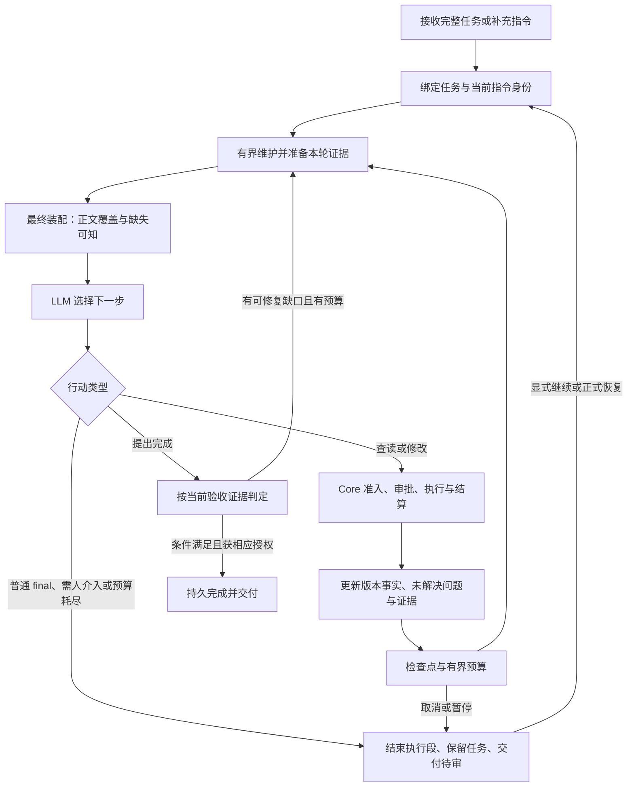

# Agent 工作流程与后续路线建议

基于 `fb1ec9c` 的当前源码和 [本轮反例](REPORT.md)。这是对既有 M17 / A–B–C 路线的细化建议，不新增阶段、Planner、TaskGraph、trace 数据库或第二套任务权威；没有自动修改 CURRENT/NEXT_TASKS 的验收状态。

## 从执行任务的 Agent 看，需要稳定回答六个问题

| 模型需要知道 | 现有权威/载体 | 必须保持的含义 |
|---|---|---|
| 我在完成哪件事，最新补充改变了什么？ | TaskAnchor + RuntimeInputEnvelope + 当前 directive | 目标/约束与本轮指令分开；摘要不能替代完整指令，继续不是新指令 |
| 哪些资料足够决定下一步，哪些仍然缺失？ | Context materialization + final packing + required/optional misses | 入选记录不等于正文已曝光；只有最终请求里的覆盖范围算已看见 |
| 现在能调用什么，需要哪种授权？ | round tool surface + Core admission/approval | 模型可见表面与可执行表面一致；工具说明不产生权限 |
| 上一步实际改变了什么？ | typed ToolOutput facts + effect receipt + resource revisions | 计划、假设预览、准备成功与实际提交分开；未知结果不能当成成功 |
| 哪些检查已充分且仍有效，下一项检查能否推进？ | ExecutionState + acceptance receipts | 当前任务需要的证据不会被普通历史淘汰；复用要匹配 task/directive/spec/world basis |
| 应继续、请求信息、让出，还是交付待审？ | completion readiness + repair potential + budgets + checkpoint | 阻塞原因可解释；普通 final 默认只结束执行段；取消/恢复有明确结果 |

这些信息已经有对应对象。改进重点是让它们在流程中保持同一身份和同一含义，不是增加更多自我分析段落让模型猜状态。

## 建议保持的执行闭环

图中的边是允许的状态变化，不是要求模型逐步机械执行。只读探索不必每次立刻减少验收缺口；修改也可能合理地使旧验证失效。Runtime 维护事实和约束，LLM 决定具体动作，Core 掌管实际权限与提交。

## 数学上应分别检查什么

**身份保持。** 同一 directive revision 的继续必须指向同一完整正文/digest。展示字符串可以更短，但不能悄悄成为新的执行输入。这能避免 Agent 在“继续”时失去尾部约束，也让恢复后复用的证据仍有明确基准。

**安全性质。** 必需正文被删且没有覆盖副本时产生 miss；物理删除避开所有保留根的强引用闭包；候选内容绑定其真实 revision。它们回答“坏事不会发生”，不能用较高平均成功率替代。

**可达性。** 合法工件必须存在受预算的读取路径；已接纳的验收需求必须能够同时容纳所需当前证明。对固定 basis 的九域任务，当前八行缓存导致 `uncovered ≥ 1`，是系统状态空间没有终点，不是模型不够努力。

**收敛。** 在任务/指令/世界/检查定义不变时，可用未覆盖验收项、未解决硬失败等构成有类型的势函数 Φ。有效补证应改善 Φ；重复同一无效动作、把当前证据换出又补回，不应重置修复预算。basis 改变时允许重新评估事实，但不能靠 revision churn 获得无限重试。沿用现有 repair 机制，不另写一个调度器。

**总量有界。** 单次压缩输入/输出有界，不推出一次 maintain 或整个任务有界。应共同计入决策模型调用、压缩/蒸馏模型调用、工具等待、重试和恢复等待。取消必须能在长等待期间到达真正的 in-flight 工作；统计调用完成后才累计使用量，不能充当调用开始前的预算准入。

## 如何减少 LLM 的无效工作

1. **每次决策给一份一致的事实视图。** 在最终预算裁剪之后再确认曝光与缺失。模型能区分“知道路径”“读过某个区间”“当前请求可见”“当前版本已验证”，减少为了弥补不可信状态而重复查读。
2. **错误返回可执行的下一步条件。** 说明失败对象、当前基准、哪些状态确实没变，以及什么输入变化可能成功。大工件应给真实可用的分页/搜索入口；patch 应给真实磁盘候选。不要把不可行建议当作恢复完成。
3. **保护有用证据，复用必须有条件。** 当前验收依赖的 PASS 优先保留，重复同域 PASS 不挤掉其他域；只有基准相同才复用。比起盲目少跑测试，这更直接降低循环验证。
4. **维护渐进执行，失败保留源。** 每次 safe point 有工作量/调用数/deadline；残余保留可逆所有权。预算不足先报告维护待续或证据缺失，不用无法证明的摘要替代任务事实。
5. **搜索优化依据实际缺口。** 继续使用现有 catalog/inverted index。先记录候选数、读取字节、查询阶段耗时、不完整原因；只有召回或排序成为真实瓶颈时才做 A4 的单一机制比较。向量检索不能修复本轮的身份、容量、读取入口或恢复根问题。

以上是待实现/验证的收益机制，本轮没有得出“token 已降低 X%”或“任务成功率已提高”的实验结论。

## 后续切片顺序

每行都是独立交付单位；不要求一次完成整表，不把审查清零设为平台工作的前置。共享契约和 compose 仍单一维护者。M17 当前状态及 CI 关闭只依据现有正式记录，本报告不作升级声明。

| 建议顺序 | 用户能获得什么 | 主要落点 | 必要验收与停止条件 |
|---|---|---|---|
| 1 | 继续/恢复仍遵守完整原始指令 | W01；TaskRecord 当前指令身份和 InputEnvelope 引用 | 长指令尾部在完整首次/继续请求中可达；摘要/正文不同大小；同 basis 语义保持。完成即停 |
| 2 | 长维护期间可以取消，失败后原文仍在 | W04 + W08；维护预算、取消与结果类型 | 阻塞中的 compactor 可取消；总调用数受预算；Err/Cancelled 不退役正文；未消费残余可继续。保持单 Actor |
| 3 | 模型不会在缺少必需正文时被告知证据齐备 | W02；最终 packing 的共享范围覆盖 | 两份必需互补片段的预算删减、未知范围、部分副本均有正确 misses；请求与 completion safety 一致 |
| 4 | 保留的旧快照持续有可恢复正文 | W03；所有 Storage GC 删除入口共享保留根 | 实际保存 A/B、完成边界 GC、正式恢复 A 后读取正文；根读取失败时暂缓删除。不会复活终态语义 |
| 5 | 合法多域验收能结束，重复检查不挤掉必要证明 | W05；当前证明保留与普通历史预算 | 九域同 basis 全 PASS、重复一域、更新进度、再改变真实 world/spec，逐一检查有效与失效条件 |
| 6 | 大工具输出能按需查看，纠错依据真实内容 | W06、W07 分成两个小切片；artifact.read 与 patch refusal | 3–8 MiB 工件请求首行/中段/尾部有限步完成；失败 patch 候选与磁盘 revision 一致 |
| 7 | 能证明这些改动降低真实任务成本 | 沿用现有宿主/工作台、日志和验证工具 | 三类真实仓库任务记录：跨模块修改、多域验收、长输出加中断恢复。具备真实 provider 条件才运行；否则明确 NOT_RUN |

## 衡量结果，而不是只数主模型轮次

后续三类任务应固定仓库起点、目标、验收条件和模型配置，再比较：

- **总成本：**decision/maintenance 模型调用分别计数，再汇总 token、wall time、工具执行时间；失败调用用实际可知 usage，不把估计冒充实测。
- **无进展动作：**相同 basis 下重复同一未改善动作、重复查读相同已可见范围、补证后又因淘汰丢证的次数。
- **交互性：**取消请求到类型化回执/确认清理的延迟；维护等待与工具执行分别测量。
- **交付正确性：**完整指令约束、已完成/未完成验收项、缺失证据、未知副作用与恢复结果。默认普通 final 仍仅待审。
- **有界性：**活跃证据条目、工作集/待外置字节、工件读取字节、维护每次调用上界与延后量。

先确保同样的可验证任务结果，再比较成本。三类任务只是产品闭环样本，不是普遍成功率证明，也不重开冻结 M15/LT-EVAL。
